# 2021-12-04

## 1.1 ファイバー積
* ``X, Y, S``集合
* ``f:X\to S,g:Y \to S``を写像

とする.
このとき

```math
\begin{aligned}
\curl{(x,y) \in X\times Y | f(x) = g(y)}
\end{aligned}
```

を``X``と``Y``のファイバー積といい, 記号``X\times_{f,S,g} Y``で表す.
写像を省略して``X\times_S Y``とも表す.
(圏論の文脈では, 写像``X\to S``は一意的である場合が多く, 省略しても問題ないため?)

当たり前だが, ``X\times_S Y \subset X\times Y``である.

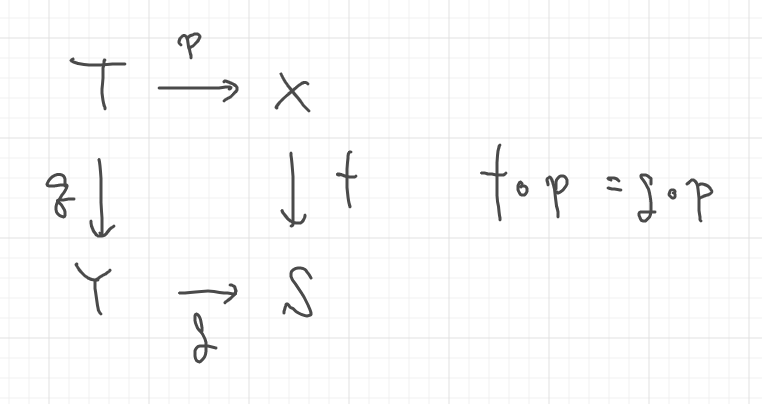

↑上記の図式を可換という.

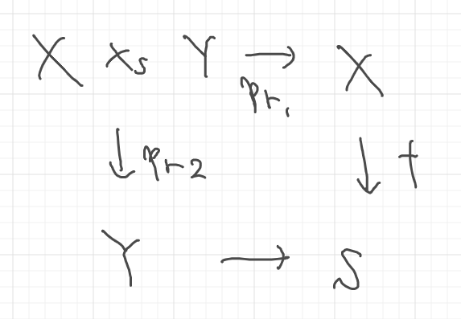

↑定義より、上図式も可換である.

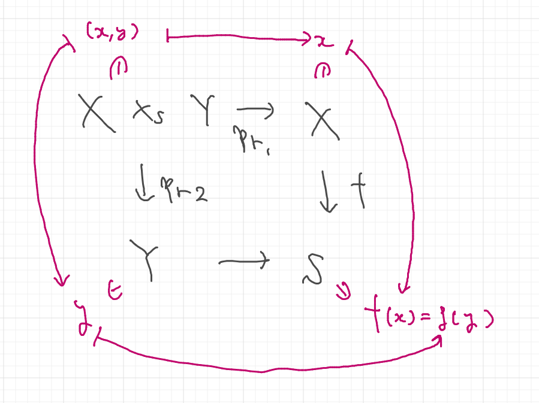

↑その証明

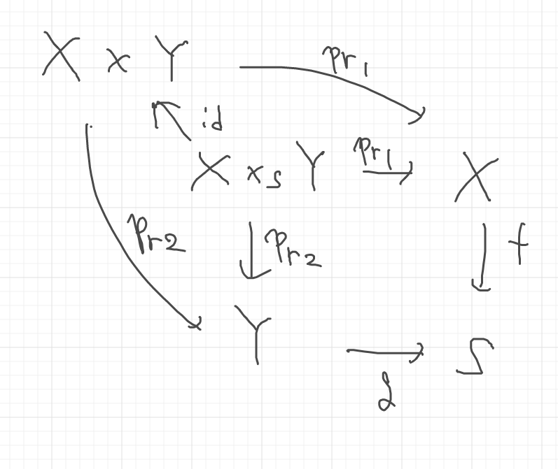

↑``X\times Y$を追加しても可換図式になっている.


↑上図式を可換にする$h$が存在する.

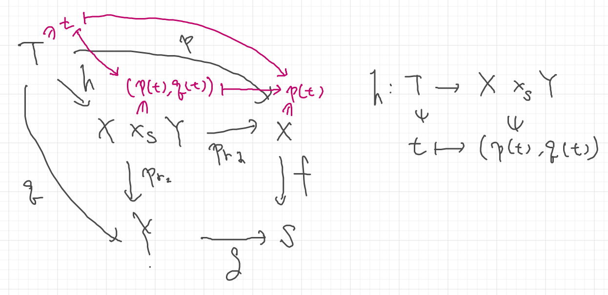

↑証明. 上記のように$h$を具体的に構成すればok.

$h$が可逆のとき, その図式を**カルテシアン**という.


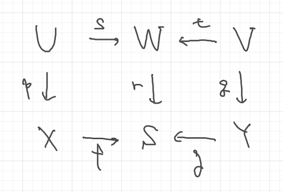

↑上記の可換図式を考える.
2つのファイバー積$X\times_S Y, U\times_W V$を作ることができて、それぞれが対応している.

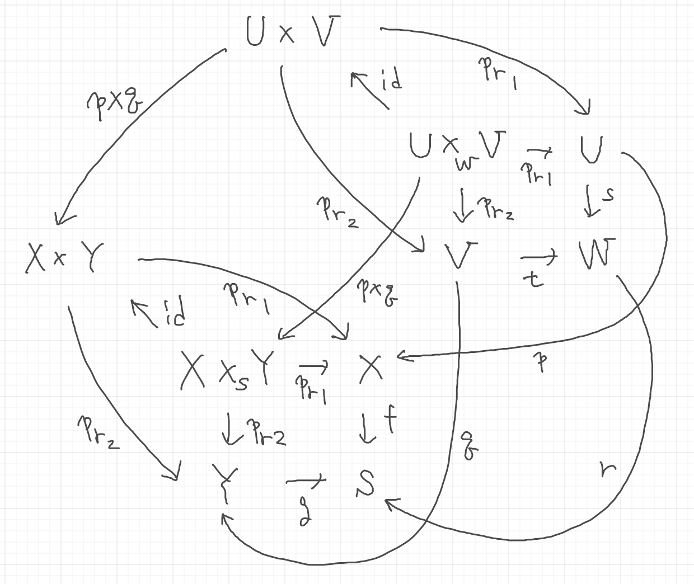

↑詳しく書いたものが上記の可換図式である.


ファイバー積の引数を増やして$X\times_S Y \times_T Z$を構成する.

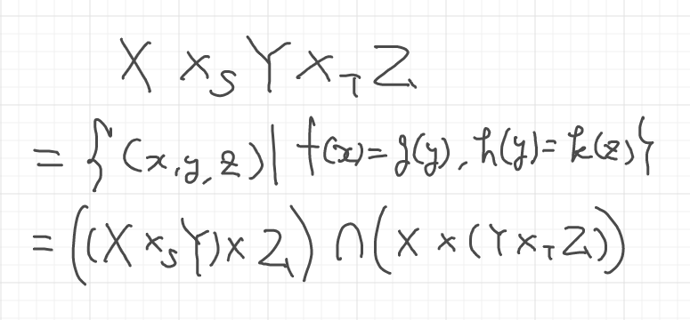

ただし, タプルのタプルは展開されると解釈した方がよい.

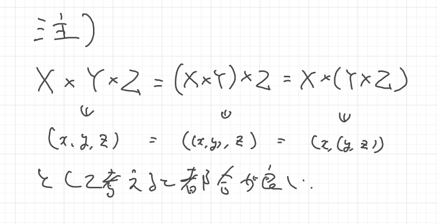

$X\times_S Y \times_T Z$を考えなければ, $Y$を共通化した次のようなファイバー積の図式が得られる.

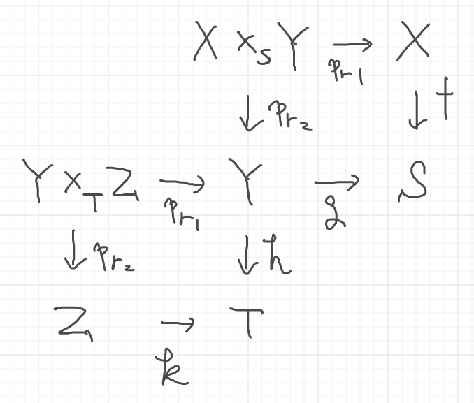

$X\times_S Y \times_T Z$を考えれば, 次のような可換図式が得られる.

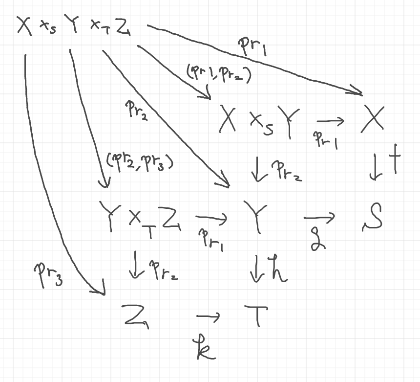

↑ここでの$(\mathrm{pr}_1, \mathrm{pr}_2), (\mathrm{pr}_2, \mathrm{pr}_3)$は, 前述の写像$h$と同様に構成されていることに注意.

タプルの同一視せずに厳密に扱う場合は次のような可換図式になる.

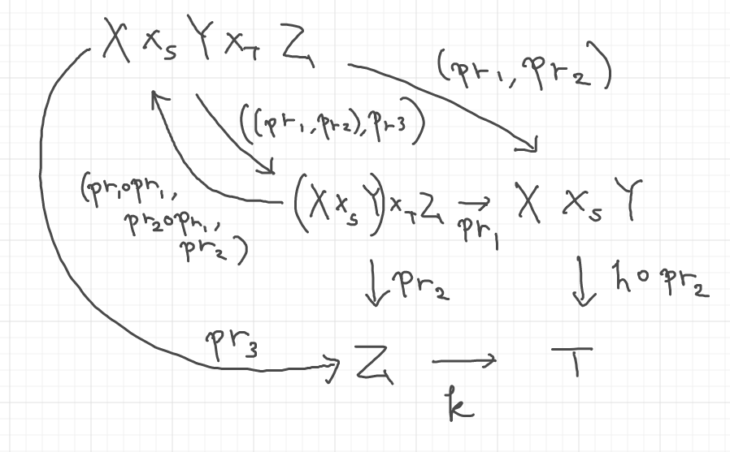
