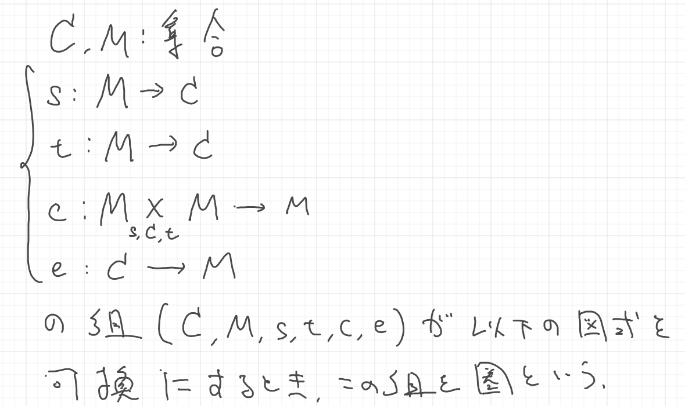
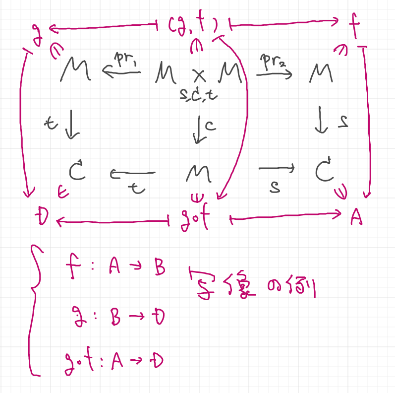
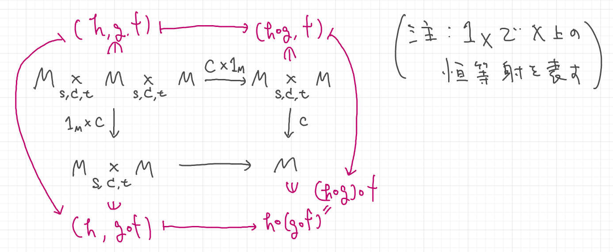
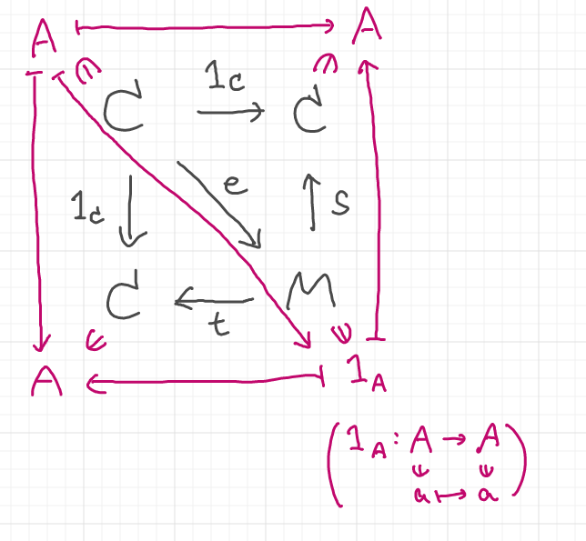
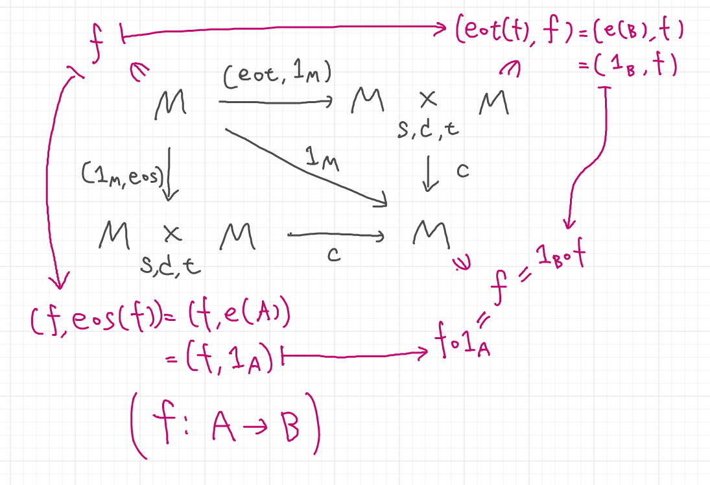

# 2021-12-05

## 1.2 圏

①射(写像)の合成がsource(始域)とtarget(終域)に関して整合していること

②射の合成が結合的であること

③対象に対して単位射が存在すること

④単位射を合成しても不変であること

**注意**
単位射が恒等写像であるとき, 恒等射という.
基本的には, 恒等射と単位射を厳密に区別する必要は無いが, 言葉の定義としては区別される.

